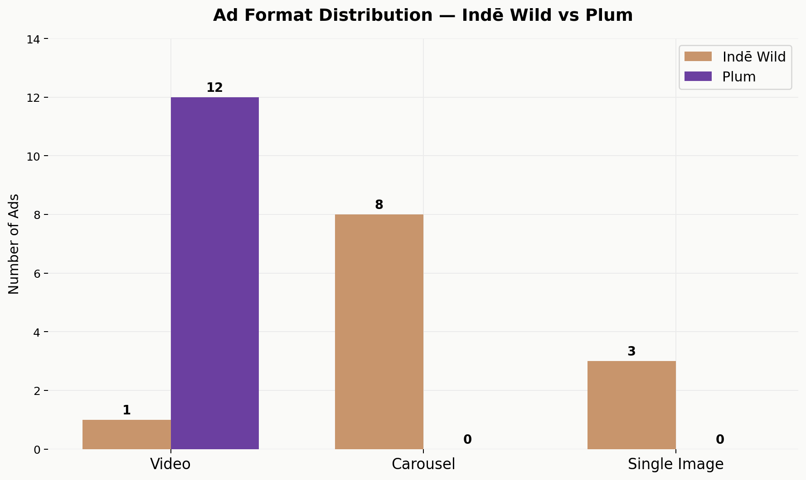
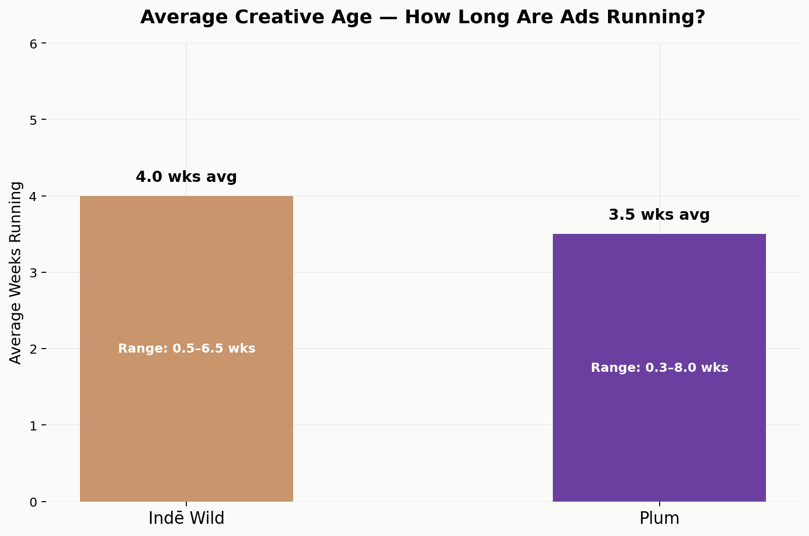
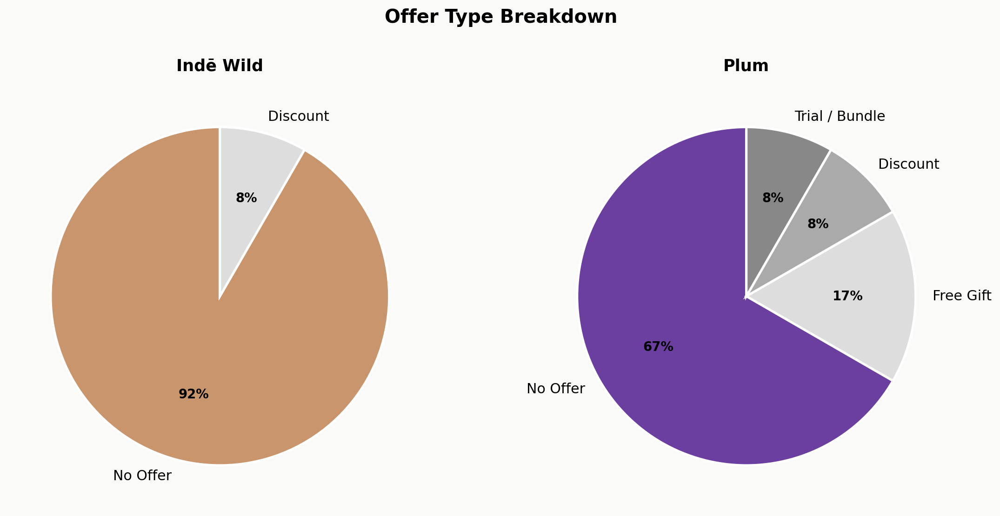
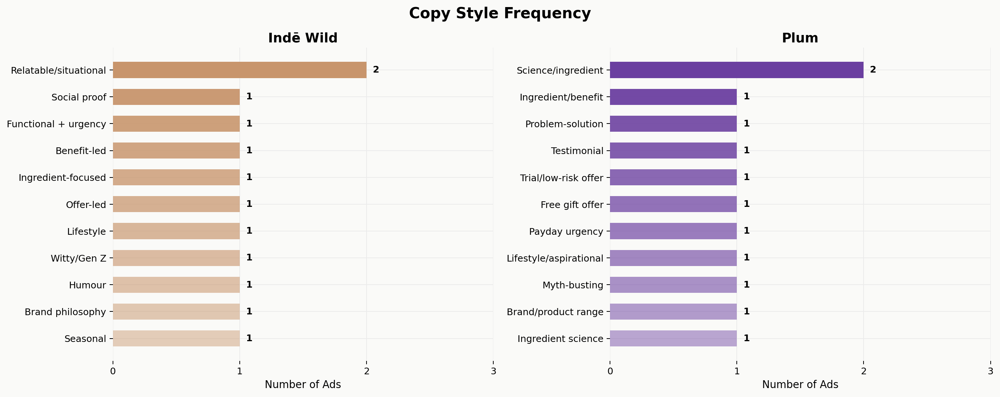

# Indē Wild vs Plum — Competitive Ad Creative Analysis

A Python-based competitive intelligence project analysing the paid ad strategies of two Indian D2C beauty brands — **Indē Wild** and **Plum** — across format, copy style, offer type, and creative age.

---

## 📊 Charts

### Ad Format Distribution

### Creative Age — How Long Are Ads Running?

### Offer Type Breakdown

### Copy Style Frequency

---

## 🔍 Key Findings

**1. Plum runs 100% video. Indē Wild runs mostly carousels.**
Every single Plum ad is a video — a deliberate bet on Reels placement for cheaper CPM and higher reach. Indē Wild's carousel strategy targets higher-intent scrollers who will swipe through product details. Two brands, two completely different funnel stages.

**2. Plum has a new user funnel. Indē Wild does not.**
Plum runs dedicated acquisition ads (₹599 trial kit, free welcome kit) to lower the barrier for first-time buyers. Indē Wild's only visible offer is 20% off — no low-risk entry point for new users.

**3. Creative age signals what's working.**
Plum's oldest ad (Black Rice Jelly Serum, running 2+ months) is almost certainly their top ROAS performer — brands kill underperforming ads within 2–3 weeks. Indē Wild's longest-running ads are both POV carousel variants, suggesting that format + hook combination is their most efficient creative.

**4. Plum sends traffic to Flipkart. Indē Wild sends to Blinkit.**
Plum is marketplace-dependent; Indē Wild is betting on quick-commerce impulse buying. Completely different distribution philosophies reflected directly in ad destinations.

**5. Indē Wild has a locked visual identity. Plum does not.**
Indē Wild's entire ad library looks like one mood board — consistent beige/cream tones, clean product shots, minimal design. Plum switches between cinematic brand videos, raw UGC face-cams, and bold discount graphics. Volume strategy vs brand-building strategy.

---

## 🛠 Tools Used

- Python (pandas, matplotlib)
- Google Colab
- Data sourced from Meta Ads Library (manual tracking)

---

## 📁 Files

| File | Description |
|------|-------------|
| `inde_wild_vs_plum_analysis.ipynb` | Full Python notebook — data, analysis, chart generation |
| `01_ad_format_comparison.png` | Bar chart: format distribution by brand |
| `02_creative_age.png` | Bar chart: average weeks running per brand |
| `03_offer_breakdown.png` | Pie charts: offer type by brand |
| `04_copy_style_frequency.png` | Horizontal bar: copy style frequency by brand |

---

## 👤 Author

**Kavya Sinha**
[LinkedIn](https://www.linkedin.com/in/kavya-sinha-009901216/)
